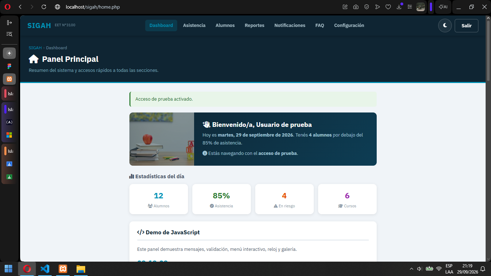
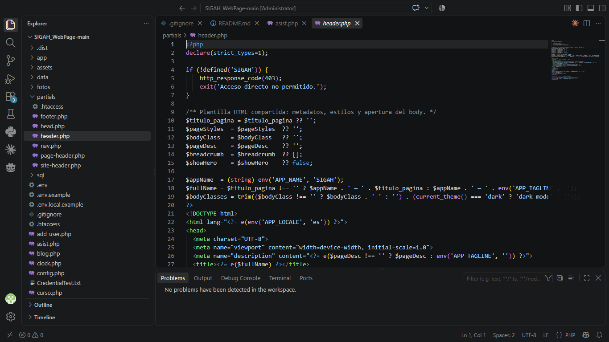
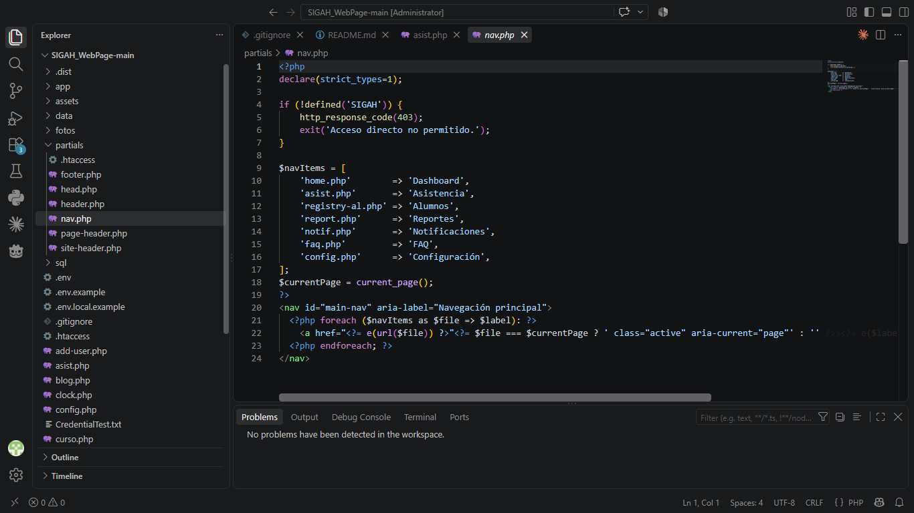
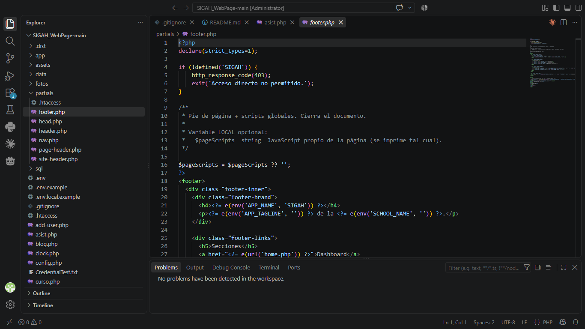
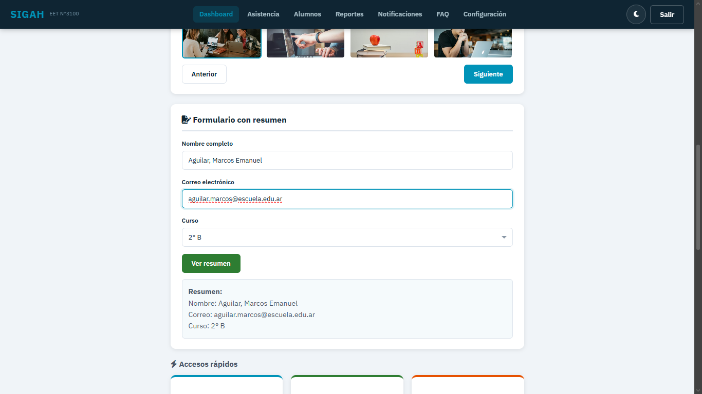
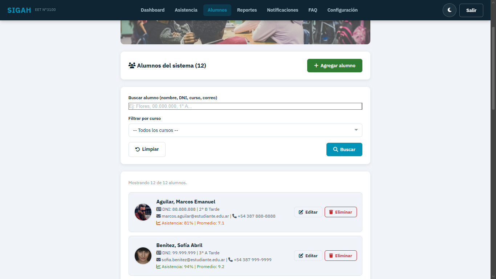

# SIGAH — Sistema Integral de Gestión de Asistencias y Horarios

Aplicación web en **PHP** para la EET N°3100 "Rep. de la India" (Salta, Argentina).
Pensada para correr en **XAMPP** (Apache + PHP + MariaDB) sin instalar nada más:
ni Composer, ni frameworks, ni dependencias externas.

Este repositorio también documenta la evolución del sitio a PHP para la **Unidad 4**:
las vistas renderizan HTML desde el servidor (SSR), reutilizan plantillas mediante
`require/include` (SSI), generan el título y el enlace activo del menú dinámicamente,
y cargan la configuración global desde `.env`.

**Prototipo de Figma:** [SIGAH](https://www.figma.com/site/LXN9SMqXKIH1vqBHc9Rfwb/SIGAH?node-id=0-1&t=NyciRH0tEqnR4roP-1)

**Repositorio:** [SIGAH_WebPage — rama main-php](https://github.com/tupacflores-rgb/SIGAH_WebPage/tree/main-php)

**Tecnologías:** HTML5, CSS3, JavaScript, PHP 8.1+, Apache/XAMPP y MariaDB/MySQL opcional.

---

## Requisitos

| Componente | Versión mínima | De dónde sale |
|---|---|---|
| Apache | 2.4 | XAMPP |
| PHP | **8.1** | XAMPP (8.2 recomendado) |
| MariaDB / MySQL | 10.4 | XAMPP (**opcional**) |

Descarga de XAMPP: <https://www.apachefriends.org/es/download.html>

---

## Instalación en XAMPP (paso a paso)

### Desde cero en Windows

1. Descargá XAMPP para Windows desde el enlace de requisitos e instalalo. Incluí
  **Apache** y **PHP**; MySQL/MariaDB es opcional para el modo predeterminado basado en JSON.
2. Abrí **XAMPP Control Panel**. Si Windows solicita permiso de firewall, permití
  Apache en redes privadas. No hace falta iniciar MySQL para la configuración básica.
3. Ubicá la carpeta `htdocs`, normalmente `C:\xampp\htdocs`.
4. Luego seguí el paso 1 de abajo para copiar el repositorio en `htdocs` con la
  carpeta `sigah`.

> Si clonás desde GitHub, cloná el repositorio dentro de `C:\xampp\htdocs`.
> Si descargás un ZIP, extraelo y evitá dejar una carpeta anidada duplicada: `index.php`
> debe quedar directamente dentro de la carpeta del proyecto.

### 1. Copiar el proyecto a `htdocs`

Copiá toda la carpeta del proyecto adentro de `htdocs` y llamala `sigah`.
La ruta local esperada es `C:\xampp\htdocs\sigah`:

```
C:\xampp\htdocs\sigah\
├── index.php
├── app\
├── partials\
├── data\
└── assets\
```

> Si la dejás en otra ruta (por ejemplo `C:\xampp\htdocs\SIGAH_WebPage`),
> también funciona: la URL base se detecta sola.

### 2. Crear el archivo `.env`

En la raíz del proyecto, copiá `.env.example` y renombralo a `.env`:

```powershell
cd C:\xampp\htdocs\sigah
Copy-Item .env.example .env
```

Ese archivo ya viene con valores listos para funcionar. Es el único lugar
donde se configura el sistema (nombre, escuela, sesión, base de datos, etc.).
Cada pantalla define `$titulo_pagina` antes de incluir `partials/header.php`, que
compone el título de la pestaña con el nombre de la aplicación.

### 3. Encender Apache

Abrí el **XAMPP Control Panel** y tocá `Start` en **Apache**.
Solo hace falta MySQL si vas a usar la base de datos (paso 6).

### 4. Abrir la web

```
http://localhost/sigah/
```

Después de iniciar sesión, el dashboard se encuentra en
<http://localhost/sigah/home.php>.

### 5. Entrar al sistema

| Rol | Usuario | Contraseña |
|---|---|---|
| Administrador | `rolando@sigah.edu.ar` o `rolando_flores` | `Sigah123@` |
| Docente | `lopez@sigah.edu.ar` o `prof_lopez` | `Docente456@` |
| Docente | `torres@sigah.edu.ar` o `prof_torres` | `Docente789@` |

También hay un botón **"Entrar como prueba"** (se apaga con `ALLOW_DEMO_LOGIN=false`).

### 6. (Opcional) Usar MariaDB en lugar de los JSON

1. `Start` en **MySQL** desde el panel de XAMPP.
2. Entrá a <http://localhost/phpmyadmin> → pestaña **Importar** → elegí `sql/sigah.sql`.
3. Generá los hashes de contraseña:
   ```powershell
   C:\xampp\php\php.exe sql\generar-hashes.php
   ```
   Copiá los `UPDATE` que imprime y ejecutalos en phpMyAdmin.
4. En el `.env` poné `DB_ENABLED=true`.

---

## Estructura del proyecto

```
sigah/
├── .env                  ← configuración GLOBAL (no se versiona)
├── .env.example          ← plantilla del .env
├── .env.local            ← configuración LOCAL de tu máquina (opcional)
├── .htaccess             ← reglas de Apache y bloqueo de archivos sensibles
│
├── index.php             ← login
├── home.php              ← dashboard
├── asist.php             ← toma de asistencia
├── registry-al.php       ← alta / edición / baja de alumnos
├── report.php            ← reportes y gráficos
├── clock.php             ← horario semanal
├── notif.php             ← notificaciones (SANE)
├── config.php            ← configuración de la institución
├── perf-adm.php          ← perfil del usuario
├── add-user.php          ← registro de usuarios
├── logout.php            ← cierre de sesión
├── faq.php · blog.php · curso.php · cv.php   ← páginas públicas
│
├── app/                  ← núcleo (no accesible por URL)
│   ├── bootstrap.php     ← arranque: .env, sesión, helpers
│   ├── Env.php           ← lector de archivos .env
│   ├── helpers.php       ← url(), asset(), e(), read_json(), csrf...
│   ├── auth.php          ← login, roles, contraseñas
│   └── database.php      ← conexión PDO opcional a MariaDB
│
├── partials/             ← plantillas compartidas
│   ├── header.php        ← <head>, metadatos, CSS y apertura del <body>
│   ├── head.php          ← alias de compatibilidad que carga header.php
│   ├── site-header.php   ← encabezado visual y acciones
│   ├── nav.php           ← menú SSR con enlace activo
│   ├── page-header.php   ← franja con título y migas de pan
│   └── footer.php        ← pie + scripts + cierre del documento
│
├── data/                 ← "base de datos" en JSON (bloqueada por .htaccess)
│   ├── credentials.json  ← usuarios
│   ├── students.json     ← alumnos
│   ├── institution.json  ← institución, ciclo lectivo, cursos
│   ├── attendance.json   ← se crea al guardar asistencia
│   └── comments.json     ← se crea al comentar en el blog
│
├── assets/
│   ├── css/style.css
│   └── js/components.js
│
└── sql/
    ├── sigah.sql             ← esquema + datos de ejemplo para MariaDB
    └── generar-hashes.php    ← genera los hashes de contraseña
```

---

## Cómo funcionan las variables de entorno

Hay **dos niveles**, y el segundo pisa al primero:

| Archivo | Para qué | ¿Se versiona? |
|---|---|---|
| `.env` | Variables **globales** del proyecto: nombre del sistema, datos de la escuela, funcionalidades, umbrales. | No (se versiona `.env.example`) |
| `.env.local` | Variables **locales** de tu computadora: ruta base, contraseña de MySQL, modo debug. | Nunca |

En el código se leen siempre igual:

```php
$nombre  = env('APP_NAME', 'SIGAH');
$umbral  = (int) env('ATTENDANCE_RISK_THRESHOLD', 85);
```

Las variables globales seguras también llegan al navegador como `window.SIGAH`
(nombre, versión, ruta base). **Nunca** pongas contraseñas ahí.

### Variables más usadas

| Variable | Qué hace |
|---|---|
| `APP_DEBUG` | `true` muestra los errores de PHP en pantalla |
| `BASE_PATH` | Fuerza la ruta base. Vacío = detección automática |
| `SCHOOL_NAME` / `SCHOOL_SHORT` | Nombre de la escuela en header, footer y páginas |
| `ALLOW_DEMO_LOGIN` | Muestra u oculta el botón "Entrar como prueba" |
| `ALLOW_SELF_REGISTER` | Permite crear usuarios desde `add-user.php` |
| `SHOW_WELCOME_ALERT` | Los `alert()` de bienvenida del proyecto original |
| `ATTENDANCE_RISK_THRESHOLD` | % de asistencia por debajo del cual un alumno queda "en riesgo" |
| `DB_ENABLED` | `true` usa MariaDB; `false` usa los JSON de `data/` |

La plantilla versionada `.env.example` contiene, entre otras, `APP_NAME`,
`SUPPORT_EMAIL` y `APP_ENV=local`. Copiala como `.env` para ejecutar el proyecto;
`.env` y `.env.local` están excluidos en `.gitignore` y no deben subirse al repositorio.

---

## Entrega del TP4: documentación y evidencias

### Figma

El prototipo de Figma está enlazado al comienzo de este README.

### Capturas de funcionamiento y estructura

Las capturas están guardadas en `fotos/` dentro del repositorio:

**Sitio ejecutándose en XAMPP** — muestra `http://localhost/sigah/home.php` y la opción activa del menú:



**Plantilla HTML y título dinámico** — `header.php`:



**Navegación modular con enlace activo** — `nav.php`:



**Pie de página compartido** — `footer.php`:



La captura del dashboard evidencia que la aplicación está servida desde localhost y que
el enlace correspondiente está activo. El título dinámico se muestra en la plantilla
`header.php`. Para completar la evidencia visual de configuración, agregá también una
captura de `.env.example` si la cátedra solicita verla como imagen; el archivo ya está
versionado en la raíz del repositorio.

### Flujo Git sugerido

El proyecto se encuentra publicado en la rama `main-php` del repositorio enlazado arriba.
Para cumplir el flujo solicitado por la consigna, creá una rama de trabajo, guardá los
cambios en commits pequeños y descriptivos, subila a GitHub y abrí un Pull Request hacia
`main`. El enlace del PR y el repositorio público se entregan en Classroom.

---

## Clase 5 – Formularios seguros con PHP

En esta entrega se incorporó la lógica del lado del servidor para procesar formularios de forma segura, con validación y sanitización de entradas provenientes de `$_POST` y `$_GET`.

### Formularios creados

- Formulario por `POST`: registro/contacto con validación de nombre, email, asunto y mensaje.
- Formulario por `GET`: búsqueda con filtro por categoría y resultados dinámicos.
- Sanitización estricta: uso de `trim()`, `filter_var()`, `FILTER_VALIDATE_EMAIL` y `htmlspecialchars()` para evitar XSS y entradas inválidas.
- Persistencia de datos: si hay errores, los campos completados se conservan para no volver a escribirlos.
- Mensajes al usuario: se muestran mensajes claros de éxito o validación en pantalla.

### Evidencias visuales

La entrega se encuentra en la carpeta `clase5/` del repositorio y aquí se muestran las evidencias reales de funcionamiento:





---

## Normalización y esquema SQL

### Parte 1: normalización aplicada al proyecto

Un registro no normalizado en un sistema escolar podría verse así:

| id_alumno | nombre | apellido | telefonos | cursos | rol | provincia | ciudad |
|---|---|---|---|---|---|---|---|
| 1 | María | García | 3815550011,3815550099 | Matemática,Historia | admin,docente | Salta | Salta |

Este diseño presenta redundancia y campos multivalorados, por ejemplo:
- `telefonos` guarda varios teléfonos en una sola cadena.
- `cursos` guarda varias materias en un mismo campo.
- `rol` guarda varios roles en un valor único.

#### 1FN (Primera Forma Normal)
Se elimina la repetición y cada campo queda atómico:

| id_alumno | nombre | apellido | telefono | curso | rol |
|---|---|---|---|---|---|
| 1 | María | García | 3815550011 | Matemática | admin |
| 1 | María | García | 3815550099 | Historia | docente |

#### 2FN (Segunda Forma Normal)
Se separan las entidades que tienen dependencia parcial sobre la clave primaria.
Entonces, se crean tablas distintas para:
- `alumnos`
- `usuarios`
- `roles`
- `cursos`
- `alumno_curso`

#### 3FN (Tercera Forma Normal)
Se extraen atributos que dependen de otros atributos no clave, por ejemplo:
- `provincias` y `ciudades` pueden separarse si fueran necesarias.
- `roles` y `cursos` quedan como tablas maestras independientes.

### Tablas resultantes

| Tabla | PK | FK | Descripción |
|---|---|---|---|
| `roles` | `id` | - | Roles del sistema |
| `usuarios` | `id` | `rol_id` -> `roles.id` | Datos de autenticación de usuarios |
| `cursos` | `id` | - | Materias o asignaturas |
| `alumnos` | `id` | `usuario_id` -> `usuarios.id` | Alumnos del sistema |
| `alumno_curso` | `id` | `alumno_id` -> `alumnos.id`, `curso_id` -> `cursos.id` | Relación de muchos a muchos |
| `asistencias` | `id` | `alumno_id` -> `alumnos.id`, `curso_id` -> `cursos.id` | Registro de asistencias |

### Archivos SQL generados

- [schema.sql](schema.sql) — DDL del esquema MySQL con base de datos, tablas, claves primarias, claves foráneas, auditoría e índices.
- [consultas.sql](consultas.sql) — INSERT, SELECT, UPDATE y DELETE de prueba para validar el sistema.

---

## Problemas frecuentes

| Síntoma | Causa y solución |
|---|---|
| Se ve el código PHP como texto | Abriste el archivo con doble clic (`file:///...`). Tiene que ser `http://localhost/sigah/` |
| `No se encontró el archivo .env` | Falta copiar `.env.example` a `.env` |
| Error 403 al entrar | Apache no está leyendo el `.htaccess`. Verificá `AllowOverride All` en `httpd.conf` |
| Apache no arranca | El puerto 80 está ocupado (Skype, IIS, VMware). Cambialo por 8080 en `Config → httpd.conf` y entrá a `http://localhost:8080/sigah/` |
| "No se pudo guardar" al crear un alumno | La carpeta `data/` no tiene permisos de escritura para el usuario de Apache |
| Las páginas viejas `.html` dan 404 | El `.htaccess` las redirige a `.php`; si falla, activá `mod_rewrite` en `httpd.conf` |

---

## Notas de seguridad

Este proyecto es **didáctico** y está pensado para un servidor local:

- Los usuarios de ejemplo de `data/credentials.json` tienen la contraseña en texto plano
  (venían así del proyecto original). Los usuarios **nuevos** se guardan con
  `password_hash()`. Si lo vas a usar en serio, regenerá todas las contraseñas.
- Todos los formularios que escriben datos usan token **CSRF**.
- Las carpetas `app/`, `partials/`, `data/` y `sql/` están bloqueadas por `.htaccess`.
  Ese bloqueo depende de Apache: si algún día lo movés a otro servidor, verificá que
  siga vigente.
- No expongas este proyecto a internet tal como está.

---

## Autor

Rolando Maximo Tupac Flores Arce — EET N°3100 "Rep. de la India", Salta.
Proyecto de la materia Diseño UI/UX. Soporte técnico: Pixel Fix.
